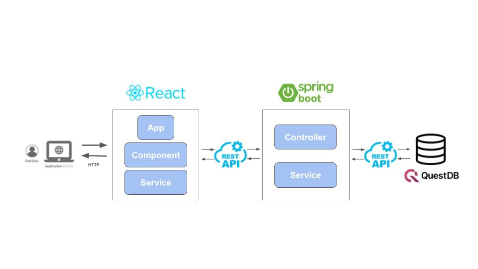
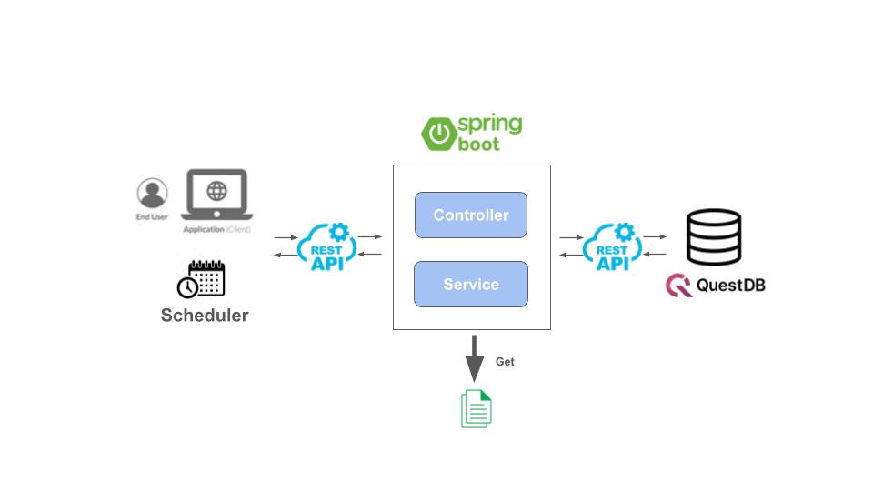

# Overview

A Spring Boot application provides services for ingesting, transforming, and serving time-series market and analytic data with QuestDB. It provides two functionalities: 
1. Historical and analytic data retrieval APIs for frontends (React).
2. Scheduled and on-demand maintenance pipeline for data ingestion, transformation and persistance into QuestDB. 

# Architecture 

## Data Retrieval Architecture 


## Data Maintenance Architecture 


# API
## Data Retrieval API for front end
```powershell
Invoke-RestMethod -Uri http://localhost:8080/{dataType}/{resultType}/{symbol} -Method Get
```
### Example Request:

Retrieve historical market data for AAPL stock
```powershell
Invoke-RestMethod -Uri http://localhost:8080/stock/full/AAPL -Method Get
```

Retrieve historical market data for SPX index
```powershell
Invoke-RestMethod -Uri http://localhost:8080/market/full/SPX -Method Get
```
## Data Maintenance API for pipeline
### Example Request:

Import daily data from raw files to QuestDB
```powershell
Invoke-RestMethod -Uri http://localhost:8080/maintenance/import-questdb -Method Post

{
  "type": "d"
}
```

Transform the raw data to time-series data
```powershell
Invoke-RestMethod -Uri http://localhost:8080/maintenance/insert-historical -Method Post

{
  "type": "d"
}
```

Aggregate the time-series data for moving average
```powershell
Invoke-RestMethod -Uri http://localhost:8080/maintenance/uodate-MA -Method Post

{
  "type": "d"
}
```
# Installation 

**Requirements:**
- Java 17+ (or the version configured in `pom.xml`)
- Maven (the project includes the Maven wrapper: `mvnw` / `mvnw.cmd`)
- A running QuestDB instance to execute writes/queries against QuestDB

**Installation steps:**

1) Clone or download the repository to your local machine.

2) Build the project using the Maven wrapper (Windows PowerShell):

```powershell
.\mvnw.cmd clean package
```

This compiles the code, runs tests, and produces a JAR file in the `target/` directory.

# How to Use

Once installed, you can run and interact with the application in several ways:

**1. Run in development mode:**

```powershell
.\mvnw.cmd spring-boot:run
```

This starts the application using the classpath and configuration from `src/main/resources`.

**2. Run the packaged JAR:**

```powershell
java -jar .\target\marketdanalyzer-*.jar
```

**3. IDE / Debug:**

Import the Maven project into IntelliJ IDEA or Eclipse. Run `MdAnalyzerApplication` as a Spring Boot app for interactive debugging.


# How to Configure

Application configuration is in `src/main/resources/application.yaml`. This file controls:

- QuestDB connection properties (URL, port)
- Application server port
- Data ingesting settings

```
spring:
  application:
    name: marketdataanalyzer

mdanalyzer:
  path:
    historicalDirectoryPath: "E:\\Work\\historical_data"
    historicalErrorPath: "E:\\Work\\historical_error"
  hostName: "127.0.0.1:9000"
```

**To customize:**

1) Edit `src/main/resources/application.yaml` before building/running.

2) Or provide environment-specific overrides using Spring Boot's standard configuration mechanisms (environment variables, command-line arguments, or external config files).

**QuestDB Setup:**

For development, run QuestDB locally using Docker. Example `docker-compose.yml` (not included in this repo):

```yaml
version: '3.7'
services:
  questdb:
    image: questdb/questdb:latest
    ports:
      - "9000:9000"   # web console
      - "8812:8812"   # ILP
```

Point `application.yaml` to the QuestDB instance (`localhost:9000`).

**Troubleshooting:**

- If the app cannot connect to QuestDB, verify the host/port in `application.yaml` and ensure QuestDB is reachable.
- Create an `application.yaml.example` with minimal required properties for easy setup.

# Project Structure

```
src/
├── main/
│   ├── java/dev/audreyl07/MarketDataAnalyzer/
│   │   ├── MdAnalyzerApplication.java      # Spring Boot entry point
│   │   ├── controller/
│   │   │   ├── DataController.java         # Data retrieval
│   │   │   └── MaintenanceController.java  
│   │   └── service/
│   │       ├── DataService.java            
│   │       ├── MaintenanceService.java  
│   │       └── QuestDBService.java         
│   └── resources/
│       ├── application.yaml                
│       └── script/                        
│           ├── analysis_market.sql         
│           ├── historical_d.sql            
│           ├── historical_raw_d.sql        
│           ├── indicator_d_52w.sql        
│           ├── indicator_d_MA.sql          
│           ├── indices_d.sql               
│           └── indices_raw_d.sql         
└── test/
    └── java/dev/audreyl07/MDAnalyzer/
        ├── MdAnalyzerApplicationTests.java # Context load test
        └── controller/
            └── DataControllerTest.java     
            └── MaintenanceControllerTest.java 
        └── controller/
            └── DataServiceTest.java   
            └── MaintenanceServiceTest.java     
            └── QuestDBServiceTest.java         

```

## REST Controllers

The application exposes two REST controllers for different responsibilities:

### DataController

**Purpose:** Query and retrieve market data for front end display. 

**Example requests:**

```powershell
# Get full OHLCV for a stock (Apple)
Invoke-RestMethod -Uri http://localhost:8080/stock/full/AAPL -Method Get
```

**Response:** JSON array of time-series data points.

### MaintenanceController

**Purpose:** Trigger data pipeline and maintenance operations (imports, transformations, aggregations).

**Example requests:**

```powershell
# Populate historical_d from raw data
Invoke-RestMethod -Uri http://localhost:8080/maintenance/insert-historical `
  -Method Post `
  -Body (@{ type = "d" } | ConvertTo-Json) `
  -ContentType 'application/json'
```

## Services

The business logic is split across three service classes:

### DataService

**Responsibilities:**
- Query QuestDB for stock/index historical data
- Transform raw query results into API-friendly JSON structures
- Provide market analysis series (52w highs/lows, MA breadth percentages)

### MaintenanceService

**Responsibilities:**
- Orchestrate multi-step data pipelines
- Build and execute SQL for transformations (window functions, aggregations)
- Manage incremental updates (query latest date, append new data)
- Coordinate full updates (52w, MA) by chaining operations

### QuestDBService

**Responsibilities:**
- Low-level HTTP client for QuestDB's `/exec` (SQL) and `/imp` (CSV import) endpoints
- Execute queries and parse JSON responses
- Upload files via multipart/form-data
- Handle errors and copy failed imports to an error directory
- Utility operations: truncate, latest date lookup

## How to Test

Run unit/integration tests using the Maven wrapper:

```powershell
.\mvnw.cmd test
```
Add new tests under `src/test/java` following the existing structure. The repository includes a test skeleton at `src/test/java/dev/audreyl07/MDAnalyzer/MdAnalyzerApplicationTests.java`.

# Future Enhancements
## Code Quality & Maintainability

- **Type-safe JSON parsing** — Replace unchecked casts in `QuestDBService` and `DataService` with proper generics or DTOs to eliminate compiler warnings
- **Error handling** — Implement custom exception types and `@ControllerAdvice` for consistent error responses across all endpoints
- **Input validation** — Add `@Valid` and Bean Validation annotations to controller request parameters

### Testing & Quality Assurance

- **Integration tests** — Add `@SpringBootTest` integration tests that exercise full request/response cycles with TestContainers for QuestDB
- **Service layer tests** — Complete unit test coverage for `MaintenanceService` and `QuestDBService` with mocked dependencies
- **Load/performance testing** — Add JMeter or Gatling tests to validate performance under load
- **Test data builders** — Implement builder pattern for test fixtures to simplify test setup

## Features & Functionality

- **Scheduled jobs** — Use `@Scheduled` to automate daily data imports and indicator updates without manual API calls
- **WebSocket support** — Add real-time data streaming for live market updates
- **Multi-database support** — Abstract the data layer to support alternative databases (PostgreSQL, TimescaleDB) in addition to QuestDB
- **Data export** — Add endpoints to export analysis results as CSV, Excel, or JSON files
- **Advanced analytics** — Extend indicators to include RSI, Bollinger Bands, volume-weighted metrics, and custom technical indicators

# Contact

For questions about the code, open an issue or contact the repository owner.
